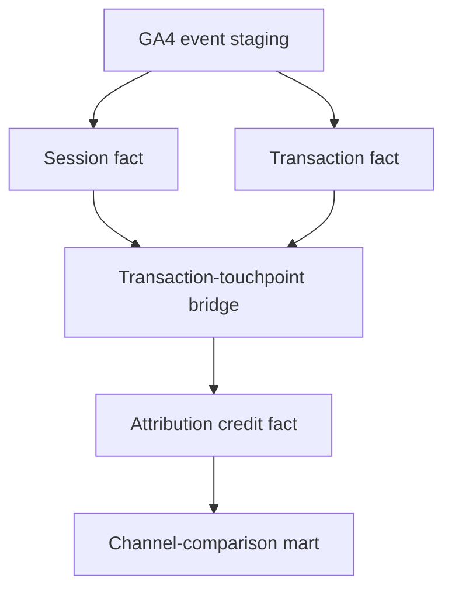

# Customer-Journey Attribution: Methodology and Findings

## Executive Summary

This analysis compares five rule-based attribution models across 5,375 canonical ecommerce transactions and $340,859 in measured revenue.

The purpose is not to declare one attribution model objectively correct. It is to identify where channel conclusions depend on attribution assumptions, distinguish robust findings from model-sensitive ones, and generate hypotheses for causal testing.

The analysis indicates that last-touch attribution understates the observed role of Organic Search and Paid Search while assigning comparatively more credit to Referral. Under position-based attribution, Organic Search gains approximately $14.8K and Referral loses approximately $22.0K in revenue credit relative to last touch.

These directions remain consistent when the analysis is restricted to transactions with a complete 30-day observation window. However, attribution redistributes observed revenue and does not measure incremental lift. Budget decisions should therefore be validated through controlled experiments and incrementality testing.

## Business Question

How does the distribution of observed conversion and revenue credit change when customer journeys are evaluated using different attribution rules?

The analysis addresses four questions:

1. Which channels appear undervalued or overvalued by last-touch reporting?
2. Which conclusions remain stable across multiple attribution models?
3. Are the conclusions sensitive to incomplete lookback windows?
4. Which findings should become priorities for incrementality testing?

## Data Scope

| Measure | Result |
|---|---:|
| Observation period | November 1, 2020–January 31, 2021 |
| Historical data coverage | 92 days |
| Attribution lookback window | 30 days |
| Canonical transactions | 5,375 |
| Canonical transaction revenue | $340,859 |
| Represented users | 4,419 |
| Transaction-touchpoint rows | 13,446 |
| Average touchpoints per transaction | 2.50 |
| Maximum touchpoints for one transaction | 12 |
| Multi-touch transactions | 3,053 |
| Direct-only transactions | 159 |
| Left-censored transactions | 1,772 |
| Complete-window transactions | 3,603 |
| Complete-window revenue | $215,994 |

The analysis uses the public Google Analytics 4 obfuscated ecommerce sample. The business setting and executive decision context are fictional, while the event, transaction, session and channel observations are derived from the public dataset.

## Measurement Architecture

The analytical warehouse separates entities by grain:

| Table | Grain | Purpose |
|---|---|---|
| `stg_ga4_events` | One GA4 event | Normalized event and traffic-source fields |
| `fct_sessions` | One user session | Session-level channel and engagement measures |
| `fct_transactions` | One canonical transaction | Deduplicated conversions and revenue |
| `bridge_transaction_touchpoints` | One transaction-session touchpoint | Eligible sessions within the lookback window |
| `fct_attribution_credits` | One model-transaction-touchpoint credit | Conversion and revenue credit by model |
| `mart_attribution_channel_comparison` | One population-model-channel combination | Executive comparison with last touch |

## Attribution Models

### First Touch

Assigns 100% of conversion and revenue credit to the earliest eligible session in the 30-day lookback window.

This model emphasizes where the observed customer journey began.

### Last Touch

Assigns 100% of credit to the final eligible session before the transaction, including Direct.

This model is used as the comparison baseline because it reflects a common reporting convention.

### Last Non-Direct Touch

Assigns 100% of credit to the latest non-Direct session. Direct receives credit only when no eligible non-Direct touchpoint exists.

This model helps evaluate how much conversion credit is assigned to Direct because of reporting rules rather than a clearly identified acquisition source.

### Linear

Distributes credit equally across every eligible touchpoint.

This model recognizes all observed sessions but assumes that every touchpoint contributed equally.

### Position-Based

Assigns greater weight to the first and final touchpoints while distributing the remaining credit across middle interactions.

For journeys with more than two touchpoints:

- 40% is assigned to the first touchpoint.
- 40% is assigned to the final touchpoint.
- 20% is distributed evenly across the middle touchpoints.

Single-touch journeys receive 100% credit on their only touchpoint, while two-touch journeys are divided evenly.

This is the primary descriptive comparison because it recognizes both acquisition and closing interactions without assuming equal influence across the entire journey.

## Observation-Window Sensitivity

Two transaction populations are compared:

### All Observed Transactions

Includes all 5,375 canonical transactions found in the dataset.

Some transactions occur within the first 30 days of available data. Their earlier touchpoints may have occurred before the dataset began and are therefore unobservable.

### Complete-Window Transactions

Includes 3,603 transactions for which the complete 30-day pre-conversion window is observable.

Comparing the two populations tests whether the direction of a channel finding changes after potentially left-censored journeys are removed.

Of the 28 model-channel comparisons, 27 retain the same directional conclusion across both populations. The only direction change occurs for the small `Other` channel under linear attribution, and the dollar difference is immaterial.

This increases confidence that the main directional findings are not explained entirely by incomplete lookback windows.

## Data-Quality Validation

The following contracts passed:

- All 5,375 canonical transactions are represented in the attribution output.
- Each attribution model reconciles to exactly 5,375 conversions.
- Each model reconciles to exactly $340,859 in total credited revenue.
- Complete-window outputs reconcile to 3,603 transactions and $215,994.
- Attribution weights sum to one for every transaction-model combination.
- Touchpoints occur before or at the associated transaction timestamp.
- Touchpoints remain within the defined 30-day lookback window.
- Transaction, user and session keys pass validity checks.
- All five model-level reconciliation statuses pass.
- All ten population-model channel-summary reconciliations pass.

The attribution credit table contains multiple models. Revenue must therefore be filtered to one attribution model before aggregation to avoid counting the same transaction revenue repeatedly.

## Findings

### 1. Organic Search is consistently understated by last touch

Organic Search gains revenue credit under every alternative model and in both transaction populations.

| Comparison with Last Touch | All Observed | Complete Window |
|---|---:|---:|
| First touch | +$35,248 | +$23,652 |
| Last non-direct | +$4,235 | +$3,068 |
| Linear | +$10,623 | +$6,553 |
| Position-based | +$14,822 | +$9,804 |

Under position-based attribution, Organic Search gains approximately 13.6% relative to its last-touch credit in the all-observed population.

First-touch attribution also moves Organic Search from the second-ranked channel to the first-ranked channel. This suggests that Organic Search frequently appears earlier in the observed journey and may contribute to discovery or consideration before another channel receives final-touch credit.

This is evidence of an observed journey role, not evidence that Organic Search caused the conversions.

### 2. Paid Search gains credit, but from a smaller base

Paid Search also gains credit under every alternative model.

| Comparison with Last Touch | All Observed | Complete Window |
|---|---:|---:|
| First touch | +$2,641 | +$1,241 |
| Last non-direct | +$103 | +$103 |
| Linear | +$998 | +$396 |
| Position-based | +$1,187 | +$539 |

The relative change is meaningful because Paid Search begins from a small last-touch revenue base. The absolute dollar movement is still considerably smaller than the movements for Organic Search and Referral.

This makes Paid Search a useful candidate for controlled incrementality testing, but not an automatic recommendation for a major budget increase.

### 3. Referral receives substantial final-touch credit

Referral loses credit under first-touch, linear and position-based attribution.

| Comparison with Last Touch | All Observed | Complete Window |
|---|---:|---:|
| First touch | -$47,213 | -$31,070 |
| Linear | -$19,390 | -$12,368 |
| Position-based | -$21,972 | -$14,402 |

This pattern suggests that Referral frequently appears near the end of the observed journey while Organic Search, Paid Search or other channels appear earlier.

Referral gains credit under last-non-direct attribution because that model removes Direct from journeys containing another identifiable channel. The result is therefore sensitive to the question being asked.

Before making a business decision, referral domains should be audited for:

- Payment gateways
- Authentication providers
- Internal or cross-domain referrals
- Partner and affiliate traffic
- Correct cross-domain and referral-exclusion configuration

A loss of heuristic attribution credit does not prove that genuine referral partners are ineffective.

### 4. Direct is highly model-dependent

Direct gains approximately $12.6K under first touch, $8.4K under linear and $7.1K under position-based attribution, but loses approximately $14.0K under last-non-direct attribution.

This is expected because the last-non-direct model explicitly removes Direct whenever another identifiable channel exists.

Direct should not be interpreted like a media channel with an adjustable budget. It may contain:

- Returning customer behaviour
- Brand demand
- Untagged marketing activity
- Lost campaign parameters
- Privacy or consent-related attribution loss
- Cross-device or cross-browser identity loss

Direct is therefore both a customer-behaviour signal and a measurement-quality signal.

### 5. Email and Affiliate changes are small in absolute dollars

Email and Affiliate generally lose small amounts of credit under multi-touch models. Their percentage changes may appear large because their last-touch revenue bases are small.

For executive reporting, both dollar change and percentage change should be shown. Percentage changes alone could exaggerate the business importance of low-volume channels.

## Model Sensitivity

The total amount of revenue reassigned between channels relative to last touch is:

| Attribution Model | All Observed | Complete Window |
|---|---:|---:|
| First touch | $50,472 / 14.81% | $33,500 / 15.51% |
| Last non-direct | $14,043 / 4.12% | $11,439 / 5.30% |
| Linear | $20,015 / 5.87% | $12,602 / 5.83% |
| Position-based | $23,118 / 6.78% | $15,111 / 7.00% |

Revenue reassigned is calculated as one-half of the sum of the absolute channel-level differences from last touch. It measures redistribution between channels without double-counting the revenue leaving one channel and entering another.

It does not represent incremental revenue.

First touch produces the largest overall change, showing that the beginning and end of observed journeys can produce materially different channel narratives.

Linear and position-based results remain comparatively stable after excluding left-censored transactions. This suggests that their main redistribution patterns are not being driven entirely by incomplete observation windows.

## Business Interpretation

The most defensible conclusion is:

> Multi-touch attribution indicates that last-touch reporting understates the observed role of Organic Search and Paid Search while concentrating substantial credit in Referral. Under position-based attribution, Organic Search gains approximately $14.8K and Referral loses approximately $22.0K relative to last touch. These directions remain consistent when the analysis is restricted to transactions with complete 30-day histories.

This conclusion should be used to prioritize investigation and experimentation, not to make an immediate budget transfer.

## Recommendations

1. **Use position-based attribution as the primary descriptive comparison.**  
   It recognizes acquisition and closing interactions while avoiding the extremes of pure first-touch or last-touch reporting.

2. **Retain last touch as a reporting baseline.**  
   Showing both models makes changes in the channel narrative transparent to stakeholders.

3. **Use the complete-window population as a sensitivity check.**  
   Present the all-observed population as the main business view and verify that important conclusions remain directionally stable after left-censored journeys are removed.

4. **Audit Referral before changing investment.**  
   Separate genuine partner referrals from technical or self-referrals.

5. **Investigate the quality of Direct traffic.**  
   Review campaign tagging, cross-domain measurement, consent behaviour and offline conversion matching.

6. **Prioritize Paid Search for incrementality testing.**  
   Its consistent positive credit shift creates a testable hypothesis, but causal evidence is required before increasing investment.

7. **Treat Organic Search as an assistance hypothesis.**  
   The attribution analysis supports its earlier-journey role, but SEO and brand effects require additional analysis before assigning incremental value.

8. **Do not optimize budgets directly from heuristic attribution.**  
   Combine journey attribution with geo experiments, conversion-lift studies and Marketing Mix Modeling.

## Limitations

- The source is a public, obfuscated GA4 ecommerce dataset.
- The business scenario is fictional.
- The dataset contains sessions and events rather than complete advertising exposure data.
- Media impressions, clicks, spend and campaign cost are not consistently available.
- Attribution is limited to observed sessions associated with `user_pseudo_id`.
- Cross-device and cross-browser journeys cannot be fully reconstructed.
- The analysis uses a 30-day lookback window; longer consideration periods are not observed.
- The dataset covers 92 days, which limits seasonality analysis.
- Some transactions are left-censored because their full pre-conversion windows precede the available data.
- Channel classification depends on the accuracy of campaign tagging and referral configuration.
- Rule-based attribution models encode assumptions; they do not estimate causal impact.
- Revenue credit should not be interpreted as incremental revenue or marginal return on advertising spend.

## Measurement Maturity Roadmap

The attribution analysis is one layer of a broader measurement framework:

1. **Journey attribution** identifies where channel conclusions depend on credit-assignment rules.
2. **Incrementality experiments** test whether selected media activity causes additional outcomes.
3. **Marketing Mix Modeling** estimates channel contribution and diminishing returns over time.
4. **Experiment-calibrated budget optimization** combines causal evidence, model estimates and business constraints.
5. **Executive reporting** communicates decisions, uncertainty and measurement limitations.

The next analytical stage is a geo-holdout incrementality study designed to test a channel-investment hypothesis generated by this attribution analysis.