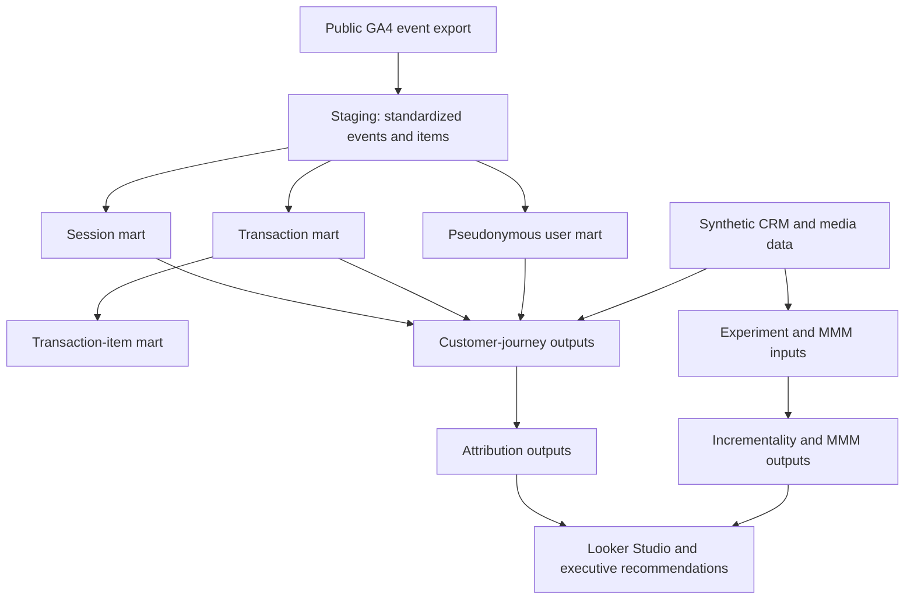

# Measurement 360 Analytical Warehouse Design

## Purpose

This document defines the analytical warehouse architecture for the Measurement 360 portfolio.

The warehouse will transform raw GA4 event exports into governed, reusable models for:

- Customer-journey analysis
- Session and funnel measurement
- Transaction and revenue reporting
- Multi-touch attribution
- First-party data activation
- Geo-holdout incrementality testing
- Marketing Mix Modeling
- Budget optimization
- Executive dashboards

The warehouse design separates source data, standardized staging models, business-ready marts, and advanced measurement outputs.

## Design Principles

### 1. Define grain before metrics

Every model must state exactly what one row represents. Metrics should not be joined across incompatible grains without prior aggregation.

### 2. Preserve source data

The public GA4 source will remain read-only. Cleaning and standardization will occur in reproducible staging and mart models.

### 3. Use one canonical definition per business metric

Examples include:

- One composite session-key definition
- One canonical transaction-key hierarchy
- One canonical revenue field
- One channel-classification framework
- One conversion definition

### 4. Preserve data-quality evidence

Problematic records will be flagged rather than silently deleted. The warehouse will retain fields that explain:

- Transaction-key method
- Source event count
- Missing identifiers
- Duplicate measurement events
- Identity conflicts
- Revenue conflicts
- Item availability

### 5. Separate observed and simulated data

The GA4 public dataset contains observed, obfuscated ecommerce events.

Future CRM, advertising, geographic, experimental, and media-spend data will be clearly labeled as synthetic or simulated. Synthetic inputs will never be presented as original Google Merchandise Store data.

### 6. Build for reproducibility

All datasets, views, tables, tests, and transformations will be reproducible from version-controlled SQL.

### 7. Apply privacy-aware identity design

The public `user_pseudo_id` will be treated as a pseudonymous browser or device identifier—not as a confirmed person or customer.

Future synthetic first-party identifiers will be stored separately from behavioural identifiers and joined only through documented privacy-safe linkage rules.

## Platform Configuration

| Setting | Value |
|---|---|
| Google Cloud project | `measurement-360-portfolio` |
| BigQuery processing location | `US` |
| Source dataset | `bigquery-public-data.ga4_obfuscated_sample_ecommerce` |
| Analysis period | 2020-11-01 through 2021-01-31 |
| Dashboard platform | Looker Studio |
| Version control | GitHub |
| Repository | `miaadnbz/privacy-durable-measurement-360` |

The Google BigQuery public ecommerce sample is documented at:

[Google Analytics ecommerce sample dataset](https://developers.google.com/analytics/bigquery/web-ecommerce-demo-dataset)

## Proposed BigQuery Datasets

### `measurement_360_stg`

Contains standardized staging views derived from source data.

Staging models will:

- Rename fields consistently.
- Convert dates and timestamps.
- Extract commonly used event parameters.
- Normalize mixed parameter types.
- Construct composite analytical keys.
- Preserve source fields required for auditing.
- Avoid applying final business-level aggregation.

### `measurement_360_mart`

Contains business-ready analytical tables.

Mart models will:

- Enforce documented grains.
- Apply canonical transaction and session rules.
- Deduplicate measurement events.
- Aggregate behavioural and financial metrics.
- Include data-quality and lineage fields.
- Support dashboards and measurement models.

### `measurement_360_sim`

Will be added in a later phase for clearly labeled synthetic data, including:

- Media delivery and spend
- CRM identities and lifecycle attributes
- Geographic treatment assignments
- Campaign metadata
- Offline conversions
- Experimental outcomes
- External MMM control variables

This dataset will not be created until its schemas and generation assumptions are documented.

## Architecture

## Staging Models

### `stg_ga4_events`

**Grain:** One row per source GA4 event row.

**Purpose:** Create a standardized event-level interface over the public GA4 export.

Planned fields include:

#### Event identity

- `event_date`
- `event_timestamp`
- `event_name`
- `user_pseudo_id`
- `event_bundle_sequence_id`
- `event_server_timestamp_offset`

#### Session fields

- `ga_session_id`
- `ga_session_number`
- `composite_session_key`
- `session_engaged`
- `engagement_time_msec`

#### Page fields

- `page_location`
- `page_title`
- `page_referrer`

#### Acquisition fields

- `source`
- `medium`
- `campaign`
- `traffic_source_name`
- `traffic_source_medium`
- `traffic_source_source`

The precise field precedence will be validated before final channel attribution is implemented.

#### Ecommerce fields

- `raw_ecommerce_transaction_id`
- `normalized_ecommerce_transaction_id`
- `transaction_id_status`
- `purchase_revenue_usd`
- `currency`
- `total_item_quantity`
- `item_array_length`

#### Privacy and quality fields

Where available:

- `analytics_storage_status`
- `ads_storage_status`
- `uses_transient_token`
- `has_user_pseudo_id`
- `has_session_id`
- `has_item_records`

**Materialization:** BigQuery view.

A view is appropriate because this layer standardizes source data without needing to duplicate the full public event export.

### `stg_ga4_items`

**Grain:** One row per item contained within a source GA4 event.

**Purpose:** Convert the repeated GA4 `items` array into a relational structure.

Planned fields include:

- Event linkage fields
- `user_pseudo_id`
- `composite_session_key`
- Raw transaction ID
- `item_id`
- `item_name`
- `item_brand`
- `item_variant`
- Item categories
- `price`
- `price_in_usd`
- `quantity`
- `item_revenue`
- `item_revenue_in_usd`
- Promotion and item-list fields

**Materialization:** BigQuery view.

## Core Analytical Marts

### `fct_sessions`

**Grain:** One row per composite session key.

**Primary key:** `composite_session_key`

**Source:** `stg_ga4_events`

Planned measures include:

- Session start and end timestamps
- Session duration
- Event count
- Page-view count
- Engaged-session flag
- Engagement time
- First landing page
- Last page
- Source, medium, and campaign
- Product views
- Add-to-cart events
- Checkout starts
- Purchase-event count
- Canonical transaction count
- Session revenue
- Funnel-stage indicators

**Materialization:** BigQuery table.

### `fct_transactions`

**Grain:** One row per final canonical transaction key.

**Primary key:** `final_transaction_key`

**Sources:**

- `stg_ga4_events`
- Documented transaction-key methodology

Planned fields include:

- Final transaction key
- Transaction-key method
- Normalized transaction ID
- Pseudo-user ID
- Composite session key
- Canonical purchase timestamp
- Purchase date
- Revenue in USD
- Currency
- Item quantity
- Source purchase-event count
- Duplicate-event count
- Transaction-ID status
- Identity-conflict history
- Revenue-conflict history
- Item-record availability

Deduplication will retain the earliest source event within each final transaction key.

**Materialization:** BigQuery table.

### `fct_transaction_items`

**Grain:** One row per canonical transaction and item record.

**Primary key:** A deterministic combination of:

- Final transaction key
- Item identifier
- Item-array position

**Sources:**

- `fct_transactions`
- `stg_ga4_items`

Planned measures include:

- Quantity
- Item price
- Item revenue
- Product and category attributes

**Materialization:** BigQuery table.

### `dim_pseudo_users`

**Grain:** One row per `user_pseudo_id`.

This model will not claim to represent a unique person.

Planned fields include:

- First event date
- Last event date
- First observed source and medium
- First observed campaign
- Session count
- Engaged-session count
- Canonical transaction count
- Total canonical revenue
- First purchase date
- Last purchase date
- Repeat-purchase indicators
- 30-day and 90-day retained revenue
- Data-quality flags

**Materialization:** BigQuery table.

## Conformed Dimensions

The following dimensions will be introduced when their underlying data becomes available.

### `dim_date`

**Grain:** One calendar date.

Will support:

- Daily, weekly, monthly, and quarterly analysis
- Fiscal or calendar-period reporting
- Seasonality and holiday indicators
- MMM aggregation

### `dim_channel`

**Grain:** One standardized channel definition.

Will provide documented mappings for:

- Paid Search
- Organic Search
- Paid Social
- Organic Social
- Display
- Email
- Referral
- Direct
- Affiliate
- Retargeting
- Other or Unassigned

Raw source and medium values will remain available for auditability.

### `dim_campaign`

**Grain:** One campaign identifier.

Will eventually connect GA4 behavioural data with synthetic advertising and campaign metadata.

### `dim_geo`

**Grain:** One geographic analysis unit.

Will support:

- Geographic treatment assignment
- Matched-market selection
- Geo-holdout analysis
- MMM geographic controls

### `dim_customer`

**Grain:** One synthetic first-party customer identifier.

This future model will be kept separate from `dim_pseudo_users`. Their relationship will be established through a clearly documented synthetic identity bridge.

## Future Measurement Facts

### `fct_media_daily`

**Grain:** One date, channel, campaign, and geographic unit.

Planned measures include:

- Impressions
- Clicks
- Spend
- Platform conversions
- Video views
- Reach
- Frequency

### `fct_experiment_assignments`

**Grain:** One experiment and geographic or audience unit.

Planned fields include:

- Experiment ID
- Treatment or control assignment
- Assignment date
- Pre-period
- Test period
- Post-period
- Eligibility and exclusion flags

### `fct_crm_conversions`

**Grain:** One synthetic first-party conversion.

Planned fields include:

- Hashed or synthetic customer identifier
- Conversion timestamp
- Conversion value
- Lifecycle stage
- Consent and eligibility status
- Media-match status

## Measurement Output Marts

### `mart_attribution_paths`

**Grain:** One conversion journey.

Will support comparison of:

- Last-touch attribution
- First-touch attribution
- Position-based attribution
- Data-driven or model-based approaches
- Incrementality-informed attribution

### `mart_geo_incrementality`

**Grain:** One experiment and geographic unit.

Will contain:

- Treatment and control outcomes
- Pre-period balance measures
- Absolute and relative lift
- Confidence intervals
- Statistical significance
- Incremental conversions
- Incremental revenue
- Incremental ROAS

### `mart_mmm_weekly`

**Grain:** One week and geographic unit.

Will combine:

- Media spend and delivery
- Revenue outcomes
- Adstock-transformed variables
- Saturation-transformed variables
- Seasonality
- Promotions
- Macro and market controls

### `mart_budget_scenarios`

**Grain:** One scenario and channel.

Will contain:

- Baseline spend
- Recommended spend
- Spend change
- Expected incremental revenue
- Marginal ROAS
- Uncertainty ranges
- Business constraints

## Key Relationships

| Parent | Child | Relationship |
|---|---|---|
| `dim_pseudo_users` | `fct_sessions` | One pseudo-user to many sessions |
| `fct_sessions` | `fct_transactions` | One session to zero or many transactions |
| `fct_transactions` | `fct_transaction_items` | One transaction to one or many item rows |
| `dim_channel` | `fct_sessions` | One standardized channel to many sessions |
| `dim_date` | Fact models | One date to many fact records |
| `dim_customer` | CRM facts | One first-party customer to many CRM events |
| `dim_geo` | Media and experiment facts | One geographic unit to many observations |

## Core Metric Definitions

### Session

A session is defined by:

`user_pseudo_id + ga_session_id`

### Engaged session

An engaged session will use the standardized `session_engaged` parameter. Its mixed source types will be converted into a Boolean representation.

### Canonical transaction

A transaction is one unique final transaction key based on the documented conflict-aware hierarchy.

### Revenue

Canonical transaction revenue is:

`ecommerce.purchase_revenue_in_usd`

### Purchaser

A purchaser is a pseudo-user associated with at least one canonical transaction.

This does not necessarily represent a known person or CRM customer.

### Duplicate measurement event

A duplicate measurement event is an additional purchase-event row associated with the same reliable final transaction key.

## Quality Gates

Each warehouse model must pass defined reconciliation tests.

### Staging-event checks

- Source event count equals staging-event count.
- Required event fields retain expected coverage.
- Event dates remain within the source period.
- Mixed parameter types are standardized.
- No unexpected event names are introduced.

Expected staging rows:

`4,295,584`

### Session checks

- Composite session key is not null where both component fields exist.
- Session start is not later than session end.
- Session event counts reconcile to staging events with valid session keys.
- Session revenue reconciles to transaction-mart revenue.

### Transaction checks

- Final transaction key is never null.
- Final transaction key is unique.
- Source purchase rows reconcile to retained and duplicate rows.
- Canonical transaction count equals 5,375 for the profiling period.
- Duplicate measurement-event count equals 317.
- No canonical transaction key spans multiple users.
- No canonical transaction key contains conflicting revenue.
- Currency equals USD for the profiling period.

### Item checks

- Item rows link to valid source or canonical transactions.
- Item quantities are non-negative.
- Missing item records are explicitly flagged.
- Item revenue reconciliation limitations are documented.

### User checks

- Every mart user exists in staging events.
- User first date is not later than user last date.
- First purchase is not later than last purchase.
- Transaction counts reconcile with `fct_transactions`.

## Materialization Strategy

| Layer | Materialization | Reason |
|---|---|---|
| Public source | External/read-only | Preserve authoritative source |
| Staging | Views | Standardization without source duplication |
| Core facts | Tables | Faster and stable analytical querying |
| Dimensions | Tables | Reusable conformed definitions |
| Measurement marts | Tables | Dashboard and modeling performance |
| Quality checks | SQL queries/views | Transparent validation |

## Sandbox Considerations

The current Google Cloud project uses BigQuery Sandbox without a linked billing account.

Sandbox-created tables and views can expire automatically. Therefore:

- All warehouse objects must be reproducible from GitHub SQL.
- Table-expiration behaviour will be checked when each dataset is created.
- Mart tables may need to be rebuilt before final Looker Studio review.
- The repository, rather than the temporary cloud objects, is the durable source of truth.

## Naming Conventions

| Object type | Prefix | Example |
|---|---|---|
| Staging model | `stg_` | `stg_ga4_events` |
| Dimension | `dim_` | `dim_pseudo_users` |
| Fact | `fct_` | `fct_transactions` |
| Output mart | `mart_` | `mart_attribution_paths` |
| Quality query | `qa_` | `qa_transaction_reconciliation` |

Additional conventions:

- Use lowercase `snake_case`.
- Use descriptive names rather than abbreviations when practical.
- Include units in ambiguous numeric fields.
- Use `_usd` for monetary values in USD.
- Use `_timestamp` for timestamps.
- Use `_date` for dates.
- Use `is_` or `has_` for Boolean fields.
- Use `_count` for counts.
- Use `_pct` for stored percentages.

## Implementation Order

1. Create BigQuery staging and mart datasets.
2. Build `stg_ga4_events`.
3. Validate event-count reconciliation.
4. Build `stg_ga4_items`.
5. Build `fct_transactions`.
6. Validate transaction and revenue reconciliation.
7. Build `fct_sessions`.
8. Build `fct_transaction_items`.
9. Build `dim_pseudo_users`.
10. Add model-specific quality checks.
11. Add synthetic CRM, media, and geographic layers.
12. Build measurement and executive-output marts.